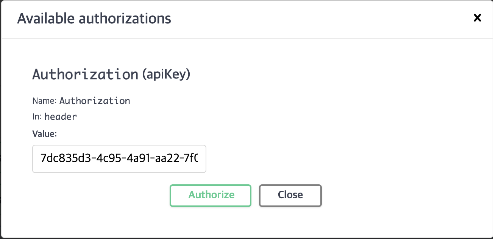

# 선택 시나리오: 콘서트 예약 서비스

## 주요 문서
* [프로젝트 마일스톤](./docs/milestone.md)
* [Sequence Diagram](./docs/sequence-diagram.md)
* [Flowchart](./docs/flowchart.md)
* [ERD](./docs/erd.md)
* **[동시성 제어 보고서](./docs/concurrency-control-report.md)**

## 패키지 구조 - 클린아키텍처
```
io/hhplus/concert
├── config
└── {domain}
    ├── presenter
    ├── domain
    ├── port
    └── usecase
```

### 패키지 구조적 특징
1. `app/config`의 위치로 최상위 패키지를 구분하고, `app` 아래에 비즈니스를 다루는 도메인 패키지로 세분화
2. 계층은 컨트롤러(Controller), 유스케이스(UseCase), 포트(Port), 도메인(Domain) 으로만 구분
3. `service`는 비즈니스 로직 계층인데, 유스케이스와 유사한 위치에 존재하므로 제외
4. `port`와 `infra`로 나누지 않은 이유는 인터페이스를 볼 때 결국은 구현체를 같이 보게 되므로 하나의 파일로, 정 어렵다면 같은 `port`패키지에 위치시키도록 작성
5. 비즈니스 요구사항을 하나의 독립적인 기능으로 정의하기 위해 각 유스케이스 클래스로 분리
6. 서로 다른 도메인과의 상호작용은 포트를 통해 처리

### 클린아키텍처의 유스케이스와 파사드패턴의 차이?

#### 이하 내용은 추측
1. 파사드
   - 여러 서비스를 조합해서 복잡한 비즈니스 요구사항을 처리하기 위해 사용
   - 무신사 같은 서드파티(카카오, 네이버, 택배 서비스 등등) 연결 포인트가 많은 서비스에 유리함?
2. 유스케이스
   - 하나의 독립적인 비즈니스 요구사항을 단일 기능으로 처리하기 위해 사용
   - 토스 같은 자사 내에서 완결되는 경우가 많은 서비스에서는 코드 복잡성을 최소화 할 수 있다는 장점?

#### 추가 정보
* 클린 아키텍처에서는 "서비스를 조합한다"는 케이스 자체가 없어지는 걸 추구.
* 우리가 구현해야 하는 비즈니스 기능은 그 자체로 고유한 기능(UseCase)이어야 함.
* 그렇지 않으면 단일책임원칙을 위반하게 되면서 하나의 기능 변경이 다른 기능에 사이드 이펙트를 주게 된다는 것.
* 각자의 장단이 있다는 접근 보다는 어떤 철학으로 접근을 하느냐가 핵심인 듯.


## 기술 스택
* Framework - [Spring Boot](https://spring.io/projects/spring-boot)
* API Documentation - [Spring REST Docs](https://spring.io/projects/spring-restdocs)
* Database
   - [MySQL 8.4](https://dev.mysql.com/doc/refman/8.4/en/)
   - [Redis](https://redis.io/docs/latest/)
* Container - [Docker](https://docs.docker.com/)
* Message Broker
   - [Kafka](https://kafka.apache.org/documentation/)
   - [RabbitMQ](https://www.rabbitmq.com/docs)

## API 명세
* Swagger 명세 경로 - `/swagger-ui/index.html`
* 토큰 인증 방법

* API 명세 스크린샷

