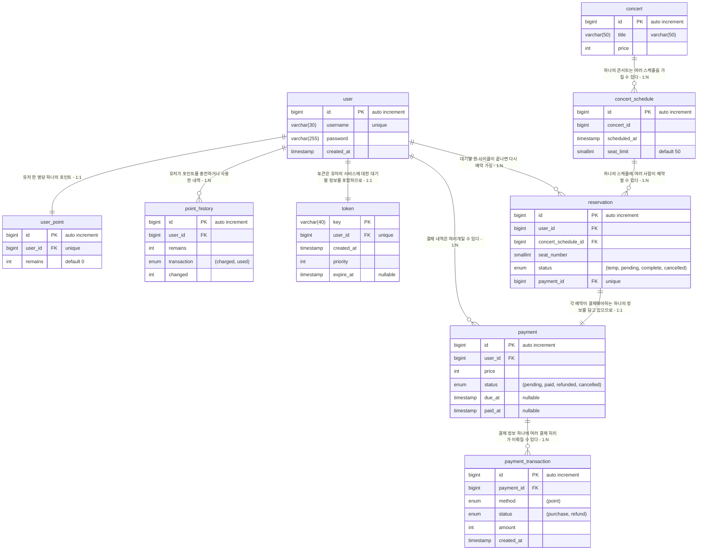

### ERD

* user - 이용자 정보
  * user_point - 이용자 포인트 잔량 정보
  * point_history - 포인트 충전/사용 이력
* token - 이용자 대기열에 대한 토큰
* concert - 공연 정보
  * concert_schedule - 공연 일정 및 좌석 정보
* reservation - 예약 정보
* payment - 결제 예정 상태 정보
  * payment_transaction - 결제/환불 처리 정보

1. 관계도에선 FK를 걸었지만 실제론 사용하지 않음
    - 참조 무결성 검사를 할 때 자식테이블을 잠가버리는 경우가 있음
    - `CASCADE` 같은 종속 효과가 걸려있을 때에도 연쇄적인 락이 걸릴 수 있음
      - 여담이지만 파이썬의 웹 프레임워크 Django에서는 FK 필드에 `CASCADE`를 설정하면 DB 엔진에 의존하지 않고 ORM 레벨에서 논리적으로 처리한다!
    - 위와 같은 상황에서 또 다른 트랜잭션이 자식테이블을 잠근 상태로 부모로 타고 올라가면서 서로 무한 대기로 빠지는 게 데드락
    - FK를 걸지 않았을 때에도 충분히 일어날 수 있는 시나리오이지만 위 무결성 검사와 종속 효과 때문에 데드락 가능성이 높아짐
    - 따라서 로직으로 관계를 연결하는 느슨한 FK를 사용하기로 함

2. reservation 테이블에 대한 처리
    - 예약 시 좌석 잔여 상태를 확인하기 위해 composite index로 `(concert_schedule_id, seat_number)` 를 가진다
      - 콘서트 스케줄마다 각 좌석은 한 사람만 예약이 가능하기 때문에 `status=complete` 조건으로 함께 검색한다
      - `(concert_schedule_id, seat_number, status)`가 아닌 이유는?
        - 조회 대상을 전부 걸면 이론상으론 더 빠르겠지만 인덱스도 하나의 테이블이기 때문에 데이터가 많아지면 오버헤드가 더 커질 수 있음
        - 한 콘서트의 스케줄의 자리 하나에 대한 인덱스이기 때문에 이미 다 거른 상태에서 `status`를 풀스캔하는 건 큰 비용이 들지 않음
      - 유니크가 아닌 이유는 한 스케줄의 한 자리에 대한 예약이 반드시 하나일 거라는 보장이 없기 때문이다
      - 따라서 테이블 계층을 최소화 하면서 성능을 최대화 하기 위해 데이터 무결성은 로직으로 처리한다
    - 유저에 대한 예약 이력을 조회하기 위해 composite index로 `(user_id, concert_schedule_id)` 를 가진다
    - `pending` 상태를 추가한 이유는 부분결제/부분환불 처리가 필요할 경우를 대비하기 위해서임

3. 예약(reservation)과 결제(payment)의 관계
    - reservation에 `payment_id` 필드를 둚으로써 영역 분리를 시도했음
    - payment 테이블을 다른 결제 케이스에도 사용할 수 있는 제네릭한 상태가 됨
      - 가령 현재 포인트 충전을 결제 영역까지 확장한다면 곧바로 point_history로 연결시켜서 사용할 수 있음

4. 결제 처리는 payment와 payment_transaction 두 스텝으로 나눴다
    - 모든 고객이 결제를 한 뒤 순순히 콘서트장으로 온다면 참 행복하겠지만...
    - 실제 고객은 환불을 받거나 예약을 걸고 도망칠 수도 있다
    - 동작을 구상한다면?
      - 예약상태의 경우
        - reservation(temp, concert_schedule_id: x, seat_number: x, payment_id: 1)
        - payment(1, pending, paid_at: _null_)
        - payment_transaction[] {}
      - 결제완료의 경우
        - reservation(complete, concert_schedule_id: x, seat_number: x, payment_id: 2)
        - payment(2, paid, paid_at: 2024-xx-xx)
        - payment_transaction[] {(amount: 500, purchase, 2024-xx-xx)}
      - 결제취소의 경우
        - reservation(cancelled, concert_schedule_id: x, seat_number: x, payment_id: 3)
        - payment(3, refunded, paid_at: 2024-xx-yy)
        - payment_transaction[] {(amount: 500, purchase, 2024-xx-yy), (amount: 500, refund, 2024-xx-zz)}
      - 예약 걸고 도망쳤을 경우
        - reservation(temp, concert_schedule_id: x, seat_number: x, payment_id: 4)
        - payment(4, cancelled, paid_at: _null_)
        - payment_transaction[] {}
