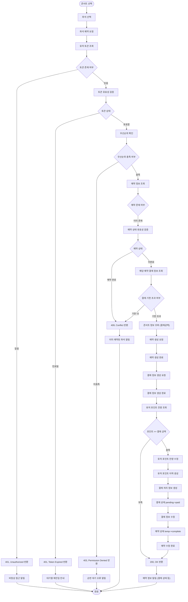

### 좌석예약요청

```mermaid
flowchart TD
    A([콘서트 선택]) --> B[좌석 선택]
    B --> C[좌석 예약 요청]
    C --> D[유저 토큰 조회]
    D --> E{토큰 존재 여부}
    E -->|없음| F[401, Unauthorized 반환]
    F --> G[비정상 접근 알림]
    E -->|있음| H[토큰 유효성 검증]
    H --> I{토큰 상태}
    I -->|만료됨| J[401, Token Expired 반환]
    J --> K[대기열 재진입 안내]
    I -->|유효함| L[우선순위 확인]
    L --> M{우선순위 충족 여부}
    M -->|미충족| N[403, Permission Denied 반환]
    N --> O[순번 대기 오류 알림]
    M -->|충족| P[예약 정보 조회]
    P --> Q{예약 존재 여부}
    Q -->|이미 존재| R[예약 상태 유효성 검증]
    R --> S{예약 상태}
    S -->|예약 완료| T[409, Conflict 반환]
    T --> U[이미 예약된 좌석 알림]
    S -->|미완료| V[해당 예약 결제 정보 조회]
    V --> W{결제 기한 초과 여부}
    W -->|기한 내| T
    W -->|기한 초과| X["콘서트 정보 조회 (결제금액)"]
    X --> Y[예약 생성 요청]
    Y --> Z[예약 생성 완료]
    Z --> AA[결제 정보 생성 요청]
    AA --> AB[결제 정보 생성 완료]
    AB --> AC[유저 포인트 잔량 조회]
    AC --> AD{포인트 >= 결제 금액}
    AD -->|충족| AE[유저 포인트 잔량 수정]
    AE --> AF[유저 포인트 이력 생성]
    AF --> AG[결제 처리 정보 생성]
    AG --> AH[결제 상태 pending->paid]
    AH --> AI[결제 정보 수정]
    AI --> AJ[예약 상태 temp->complete]
    AJ --> AK[예약 수정 완료]
    AD -->|부족| AM
    AK --> AM[200, OK 반환]
    AM --> AN["예약 정보 알림 (결제 상태 등)"]
    
    G --> AO([완료])
    K --> AO
    O --> AO
    U --> AO
    AN --> AO
```