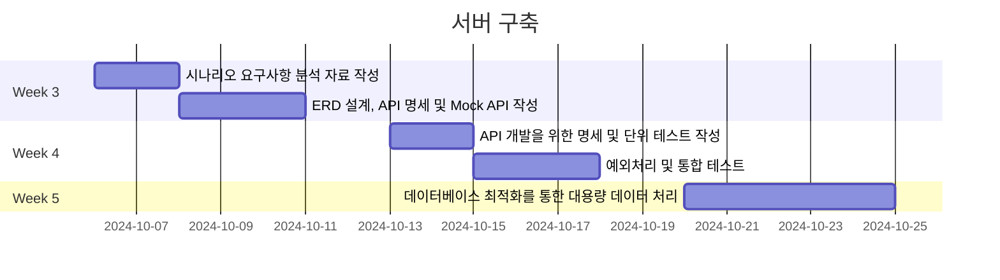
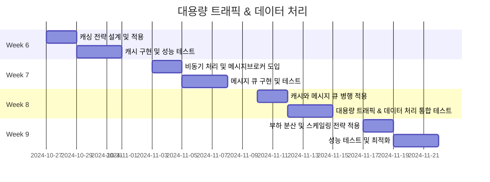
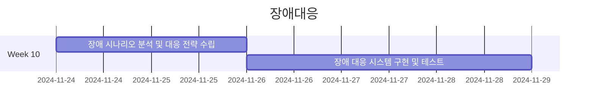

## 프로젝트 마일스톤

### 주요 사항
- 채점이 진행되는 금요일과 발제가 시작되는 토요일은 휴일로 가정
- 일정이 이미 공개된 3주차 이후는 작업이 실제로 진행될 경우를 구상해서 작성

### 3주차 (2024-10-06 ~ 2024-10-10)
- 시나리오 요구사항 분석 자료 작성
    - 기간: 2024-10-06 ~ 2024-10-07 (2일)
    - 내용:
        - 각 시나리오별 요구사항 분석
        - 시퀀스 다이어그램, 플로우 차트 작성
- ERD 설계, API 명세 및 Mock API 작성
    - 기간: 2024-10-08 ~ 2024-10-10 (3일)
    - 내용:
        - 데이터베이스 ERD 설계
        - API 명세서 작성, 각 엔드포인트의 요청/응답 정의
        - Mock API 구현, 클라이언트 연동 테스트

### 4주차 (2024-10-13 ~ 2024-10-17)
- API 개발을 위한 명세 및 단위 테스트 작성
    - 기간: 2024-10-13 ~ 2024-10-14 (2일)
    - 내용:
        - API 엔드포인트에 대한 서비스 명세 작성
        - 서비스 레이어 인터페이스 정의 및 각 메소드의 기능 명세 작성
        - 각 명세에 대한 단위테스트 작성
- 예외처리 및 통합 테스트
    - 기간: 2024-10-15 ~ 2024-10-17 (3일)
    - 내용:
        - API 엔드포인트 구현
        - 예외 처리 및 인증 로직 구현
        - 엔드포인트에 대한 단위 테스트 작성

### 5주차 (2024-10-20 ~ 2024-10-24)
- 데이터베이스 최적화를 통한 대용량 데이터 처리
    - 기간: 2024-10-20 ~ 2024-10-24 (5일)
    - 내용:
        - 대용량 데이터를 효율적으로 처리하기 위한 계획 수립
        - 데이터베이스 관련 테스트 수행 및 성능 검증

### 6주차 (2024-10-27 ~ 2024-10-31)
- 캐싱 전략 설계 및 적용
    - 기간: 2024-10-27 ~ 2024-10-28 (2일)
    - 내용:
        - 캐싱을 요구하는 부분 식별 및 캐싱 전략 수립
        - Redis 캐시 스토리지 설정
- 캐시 구현 및 성능 테스트
    - 기간: 2024-10-29 ~ 2024-10-31 (3일)
    - 내용:
        - 캐시 적용을 통해 데이터 조회 성능 개선
        - 캐시 적용 전후 성능 비교 및 최적화

### 7주차 (2024-11-03 ~ 2024-11-07)
- 비동기 처리 및 메시지브로커 도입
    - 기간: 2024-11-03 ~ 2024-11-04 (2일)
    - 내용:
        - 비동기 처리가 필요한 작업 선별
        - 메시지브로커 도입 및 비동기 환경 구축
- 메시지 큐 구현 및 테스트
    - 기간: 2024-11-05 ~ 2024-11-07 (3일)
    - 내용:
        - 메시지브로커를 활용한 기능 구현
        - 비동기 처리 안정성 및 성능 테스트

### 8주차 (2024-11-10 ~ 2024-11-14)
- 캐시와 메시지 큐 병행 적용
    - 기간: 2024-11-10 ~ 2024-11-11 (2일)
    - 내용:
        - 캐시와 메시지 큐를 병행 적용하여 읽기 및 쓰기 성능을 최적화
        - 높은 트래픽 상황에서 안정성을 확보하도록 시스템 설계
- 대용량 트래픽 & 데이터 처리 통합 테스트
    - 기간: 2024-11-12 ~ 2024-11-14 (3일)
    - 내용:
        - CPU, 메모리, 네트워크 I/O 등의 시스템 자원 사용률 모니터링
        - 캐시와 메시지 큐가 포함된 전체 시스템에 대한 통합 테스트

### 9주차 (2024-11-17 ~ 2024-11-21)
- 부하 분산 및 스케일링 전략 적용
    - 기간: 2024-11-17 ~ 2024-11-18 (2일)
    - 내용:
        - 로드 밸런서 설정 및 부하 분산 구현
        - 오토 스케일링 적용
- 성능 테스트 및 최적화
    - 기간: 2024-11-19 ~ 2024-11-21 (3일)
    - 내용:
        - 전체 시스템에 대한 성능 테스트 실시
        - 발견된 병목 지점 최적화

### 10주차 (2024-11-24 ~ 2024-11-28)
- 장애 시나리오 분석 및 대응 전략 수립
    - 기간: 2024-11-24 ~ 2024-11-25 (2일)
    - 내용:
        - 가능한 장애 시나리오 분석 및 우선순위 결정
        - 각 시나리오에 대한 대응 방안 수립
- 장애 대응 시스템 구현 및 테스트
    - 기간: 2024-11-26 ~ 2024-11-28 (3일)
    - 내용:
        - 장애 모니터링 및 알림 시스템 구축
        - 장애 상황 시뮬레이션 및 대응 체계 테스트
