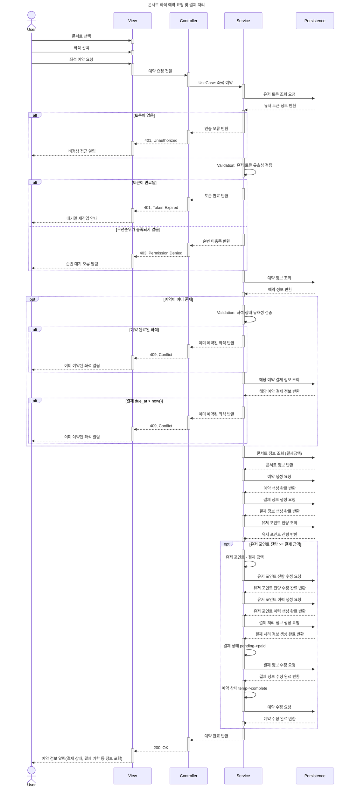

### 좌석 예약 요청

```mermaid
sequenceDiagram
    title 콘서트 좌석 예약 요청 및 결제 처리
    actor U as User
    participant V as View
    participant C as Controller
    participant S as Service
    participant P as Persistence

    U->>+V: 콘서트 선택
    deactivate V
    U->>+V: 좌석 선택
    deactivate V
    U->>+V: 좌석 예약 요청
    V->>+C: 예약 요청 전달
    deactivate V
    C->>+S: UseCase: 좌석 예약
    deactivate C
    S->>P: 유저 토큰 조회 요청
    deactivate S
    P-->>+S: 유저 토큰 정보 반환
    alt 토큰이 없음
        S-->>+C: 인증 오류 반환
        deactivate S
        C-->>+V: 401, Unauthorized
        deactivate C
        V-->>U: 비정상 접근 알림
        deactivate V
    end
    activate S
    S->>S: Validation: 유저 토큰 유효성 검증
    deactivate S
    alt 토큰이 만료됨
        activate S
        S-->>+C: 토큰 만료 반환
        deactivate S
        C-->>+V: 401, Token Expired
        deactivate C
        V-->>U: 대기열 재진입 안내
        deactivate V
    else 우선순위가 충족되지 않음
        activate S
        S-->>+C: 순번 미충족 반환
        deactivate S
        C-->>+V: 403, Permission Denied
        deactivate C
        V-->>U: 순번 대기 오류 알림
        deactivate V
    end
    activate S
    S->>P: 예약 정보 조회
    deactivate S
    P-->>+S: 예약 정보 반환
    deactivate S
    opt 예약이 이미 존재
        activate S
        S->>S: Validation: 좌석 상태 유효성 검증
        deactivate S
        alt 예약 완료된 좌석
            activate S
            S-->>+C: 이미 예약된 좌석 반환
            deactivate S
            C-->>+V: 409, Conflict
            deactivate C
            V-->>U: 이미 예약된 좌석 알림
            deactivate V
        end
        activate S
        S->>P: 해당 예약 결제 정보 조회
        deactivate S
        P-->>S: 해당 예약 결제 정보 반환
        alt 결제 due_at > now()
            activate S
            S-->>+C: 이미 예약된 좌석 반환
            deactivate S
            C-->>+V: 409, Conflict
            deactivate C
            V-->>U: 이미 예약된 좌석 알림
            deactivate V
        end
    end
    activate S
    S->>P: 콘서트 정보 조회 (결제금액)
    deactivate S
    P-->>S: 콘서트 정보 반환
    activate S
    S->>P: 예약 생성 요청
    deactivate S
    P-->>S: 예약 생성 완료 반환
    activate S
    S->>P: 결제 정보 생성 요청
    deactivate S
    P-->>S: 결제 정보 생성 완료 반환
    activate S
    S->>P: 유저 포인트 잔량 조회
    deactivate S
    P-->>S: 유저 포인트 잔량 반환
    activate S
    deactivate S
    opt 유저 포인트 잔량 >= 결제 금액
        activate S
        S->>S: 유저 포인트 - 결제 금액
        S->>P: 유저 포인트 잔량 수정 요청
        deactivate S
        P-->>S: 유저 포인트 잔량 수정 완료 반환
        activate S
        S->>P: 유저 포인트 이력 생성 요청
        deactivate S
        P-->>S: 유저 포인트 이력 생성 완료 반환
        activate S
        S->>P: 결제 처리 정보 생성 요청
        deactivate S
        P-->>S: 결제 처리 정보 생성 완료 반환
        activate S
        S->>S: 결제 상태 pending->paid
        S->>P: 결제 정보 수정 요청
        deactivate S
        P-->>S: 결제 정보 수정 완료 반환
        activate S
        S->>S: 예약 상태 temp->complete
        S->>P: 예약 수정 요청
        deactivate S
        P-->>S: 예약 수정 완료 반환
        activate S
        deactivate S
    end
    activate S
    S-->>+C: 예약 완료 반환
    deactivate S
    C-->>+V: 200, OK
    deactivate C
    V-->>U: 예약 정보 알림(결제 상태, 결제 기한 등 정보 포함)
    deactivate V
```
